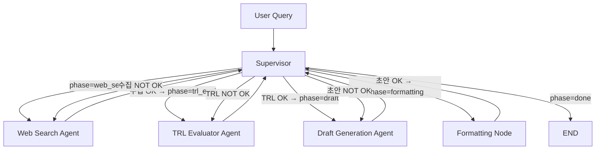

# SK하이닉스 차세대 반도체 R&D 전략 분석 에이전트

HBM4, PIM(AiMX), CXL 기술에 대한 경쟁사별 기술 성숙도(TRL)를 자동 분석하고, R&D 의사결정을 위한 전략 보고서를 생성하는 LangGraph 기반 멀티에이전트 시스템

## Overview
- **Objective** : 경쟁사(삼성전자, 마이크론) 대비 SK하이닉스의 기술 성숙도를 NASA TRL 9단계 기준으로 분석하여, 투자 우선순위 의사결정에 기여하는 전략 보고서 자동 생성
- **Method** : LangGraph Supervisor 패턴 — Supervisor가 업무 배분 및 품질 게이트(OK/NOT OK)를 수행하고, 하위 에이전트가 수집·TRL판정·보고서생성·규격화를 담당
- **Tools** : LangGraph, LangChain, Tavily, GPT-4o-mini, FAISS

## Features
- 실시간 웹 검색 기반 최신 R&D 정보 수집 (Tavily API, 18개 쿼리, 1.5초 딜레이)
- **TRL Evaluator Agent 독립 분리**: NASA TRL 9단계 기준 3사 × 3기술 = 9개 판정 전담
- TRL 4~6 간접 추정 시 특허·채용·장비발주 등 간접 지표 활용 및 한계 명시
- Draft Generation Agent: TRL 판정 결과를 입력으로 받아 보고서 초안 작성에만 집중
- 확증 편향 방지 전략: 3사 대칭 검색, 소스 다양성 강제, 반박 근거 검토

## Tech Stack

| Category | Details |
|------------|-------------------------------|
| Framework  | LangGraph, LangChain, Python |
| LLM        | GPT-4o-mini via OpenAI API |
| Search     | Tavily API (basic depth, month range) |
| Retrieval  | Hybrid (bge-m3 Dense+Sparse) + Parent Document Retrieval |
| Embedding  | BAAI/bge-m3 |
| Vector DB  | FAISS |
| Evaluation | Hit Rate@K, MRR |

## Agents



- **Supervisor** : 업무 배분, 품질 게이트(OK/NOT OK), 최종 승인. 최대 3회 반복 후 Safety Valve 발동
- **Web Search Agent** : Tavily 웹 검색, 편향 방지 점검 (소스 다양성·기업 대칭성), 18개 쿼리 × 1.5초 딜레이
- **TRL Evaluator Agent** *(v2 신규)* : NASA TRL 9단계 기준 3사×3기술 TRL 판정 전담, 간접 추정 플래그+근거 명시, 반박 근거 검토
- **Draft Generation Agent** : TRL 판정 결과를 입력으로 받아 전략 보고서 초안 작성
- **Formatting Node** : 보고서 규격 검증 및 최종 마크다운 저장 (에이전트가 아닌 노드/도구)

## Retrieval 성능

> 측정일: 2026-04-15 | 말뭉치: 27개 문서 (정답 10개 + 혼동 유발 분산 17개) | 평가 쿼리: 5개
> 재현: `python evaluation/evaluate.py --create-sample`

| 지표 | 목표 | 실측 | 판정 |
|------|------|------|------|
| Hit Rate@5 | ≥ 0.80 | **1.0000** | ✅ 통과 |
| MRR | ≥ 0.65 | **0.8000** | ✅ 통과 |

**쿼리별 상세**

| # | Query | Hit@5 | RR |
|---|-------|-------|----|
| Q1 | SK hynix HBM4 mass production 2025 | ✅ | 1.000 |
| Q2 | Samsung HBM4 development status | ✅ | 1.000 |
| Q3 | Micron CXL memory expander product | ✅ | 1.000 |
| Q4 | SK hynix AiMX PIM technology | ✅ | 0.500 (SK hynix PIM 특허 문서 1위 경쟁) |
| Q5 | CXL 3.0 memory pooling data center | ✅ | 0.500 (CXL vs NVLink 문서 1위 경쟁) |

Q4·Q5는 쿼리 키워드를 공유하는 관련 분야 문서(혼동 유발)가 BM25에서 상위 경쟁을 일으켜 정답이 2위로 밀렸으나, 모두 Top-5 내 적중. 실운영에서는 BGE-M3 임베딩 기반 semantic retrieval로 키워드 유사성 한계를 완화할 계획.

## Directory Structure

```
├── agents/                    # Agent 모듈
│   ├── supervisor.py          # Supervisor (업무 배분 + 품질 게이트)
│   ├── web_search.py          # Web Search Agent (검색 + 편향 방지)
│   ├── trl_evaluator.py       # TRL Evaluator Agent (TRL 판정 전담) ← v2 신규
│   └── draft_gen.py           # Draft Generation Agent (보고서 초안)
├── nodes/                     # 노드(도구) 모듈
│   └── formatter.py           # Formatting Node (규격화)
├── prompts/                   # 프롬프트 템플릿
│   ├── supervisor_prompt.py   # Supervisor 검증 프롬프트 (TRL 검증 추가)
│   ├── web_search_prompt.py   # Web Search 쿼리 생성 프롬프트
│   ├── trl_evaluator_prompt.py# TRL Evaluator 프롬프트 ← v2 신규
│   └── draft_gen_prompt.py    # Draft Generation 프롬프트 (TRL 규칙 제거)
├── models/                    # 데이터 모델
│   └── state.py               # AgentState, Pydantic 모델
├── evaluation/                # 평가 스크립트
│   └── evaluate.py            # Hit Rate@K, MRR 산출
├── outputs/                   # 생성된 보고서
├── app.py                     # 실행 스크립트 (LangGraph 조립)
├── config.py                  # 설정 (API 키, 모델, 파라미터)
├── SK_Hynix_RnD_Agent_Design_v2.md  # 설계 문서
├── requirements.txt
└── README.md
```

## Setup & Run

```bash
# 1. 가상환경 활성화 (macOS/Linux)
source .venv/bin/activate

# 2. 환경 변수 설정
# .env 파일에 OPENAI_API_KEY, TAVILY_API_KEY 입력
# (Tavily 키는 https://app.tavily.com 에서 발급, tvly-... 형식)

# 3. 실행
python app.py

# 4. (선택) 커스텀 쿼리 실행
python app.py "HBM4와 CXL 기술의 SK하이닉스 경쟁력을 분석해주세요"

# 5. Retrieval 평가
python evaluation/evaluate.py --create-sample  # 샘플 데이터 생성
python evaluation/evaluate.py                  # 평가 실행
```

## v2 변경 이력

| 항목 | 변경 내용 |
|------|-----------|
| TRL Evaluator Agent 분리 | Draft Generation에서 TRL 판정 로직을 독립 에이전트로 분리 |
| Supervisor TRL 검증 추가 | trl_eval Phase 신규 추가, 9개 판정 완결성·간접추정 근거 검증 |
| Draft Generation 단순화 | TRL 판정 JSON 생성 제거, trl_assessments 입력 기반 보고서 작성 |
| 임베딩 후보군 확장 | jina-embeddings-v3, voyage-3-large 추가 검토 (설계 문서) |
| Rate limit 대응 | 쿼리 18개 상한, 1.5초 딜레이, 연속 실패 시 조기 종료 |
| TIME_RANGE 수정 | "6m" (무효값) → "month" (Tavily 유효값) |


