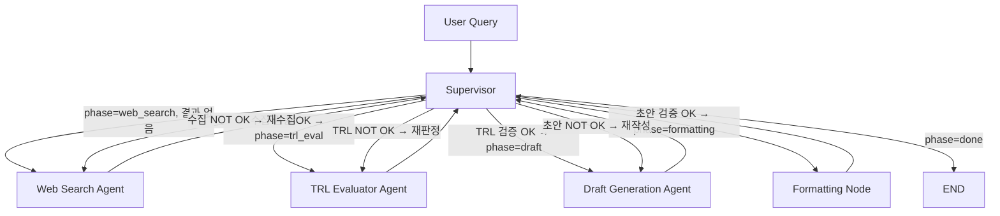

# SK하이닉스 차세대 반도체 R&D 전략 분석 에이전트 설계서 v2

> **최종 수정**: 2026-04-15 | **버전**: 2.0

---

## 1. 프로젝트 개요

### 1.1 목적
HBM4, PIM(AiMX), CXL 기술에 대한 경쟁사별 기술 성숙도(TRL)를 자동 분석하고, R&D 의사결정을 위한 전략 보고서를 생성하는 LangGraph 기반 멀티에이전트 시스템 구축

### 1.2 목표
- 경쟁사(삼성전자, 마이크론) 대비 SK하이닉스의 기술 성숙도를 NASA TRL 9단계 기준으로 정량 평가
- 투자 우선순위 의사결정에 기여하는 전략 보고서 자동 생성
- 확증 편향 방지 메커니즘을 통한 객관적 분석 보장

### 1.3 기술 스택

| 구분 | 세부 내용 |
|------|-----------|
| Framework | LangGraph, LangChain, Python 3.11 |
| LLM | GPT-4o-mini (gpt-4o 선택 가능) via OpenAI API |
| Search | Tavily API (basic depth, month 범위) |
| Retrieval | Hybrid (bge-m3 Dense+Sparse) + FAISS |
| Embedding | BAAI/bge-m3 |
| Vector DB | FAISS |
| Evaluation | Hit Rate@K, MRR |

---

## 2. 임베딩 모델 선정

### 2.1 후보군

| 모델 | 제공 | 최대 토큰 | 특징 |
|------|------|-----------|------|
| **BAAI/bge-m3** | BAAI (오픈소스) | 8192 | Dense+Sparse 동시 추출, 다국어, Hybrid 검색에 최적 |
| multilingual-e5-large | Microsoft (오픈소스) | 512 | 다국어 강점, MTEB 상위권 |
| KoSimCSE-roberta | 한국어 특화 (오픈소스) | 512 | 한국어 의미 유사도 특화, 영문 약세 |
| nomic-embed-text | Nomic AI (오픈소스) | 8192 | 긴 문서 처리, 단일 언어 |
| **jina-embeddings-v3** | Jina AI (오픈소스) | 8192 | Task-specific LoRA 어댑터, 다국어, 긴 기술 문서 처리 강점 |
| **voyage-3-large** | Voyage AI (유료 API) | 32000 | 기술 문서·코드 임베딩 특화, Anthropic 공식 추천 파트너 |

> **Note**: jina-embeddings-v3, voyage-3-large는 v2에서 추가 검토된 모델 (섹션 2.4 참조)

### 2.2 선정 기준

| 기준 | 가중치 | 설명 |
|------|--------|------|
| 한영 혼용 지원 | 30% | 한국어·영어 혼재 기술 문서 처리 품질 |
| 기술 용어 표현력 | 20% | HBM, TSV, CXL 등 반도체 약어 임베딩 품질 |
| **도메인 적합성** | **20%** | 반도체 기술 약어(HBM, TSV, CXL), 스펙시트, 특허 문서 등 기술 도메인 임베딩 품질 |
| 검색 특화 (Dense+Sparse) | 15% | Hybrid 검색을 위한 단일 모델 Dense+Sparse 동시 지원 여부 |
| 최대 토큰 길이 | 10% | 장문 기술 보고서·특허 처리 가능 여부 (≥ 4096 권장) |
| 추론 비용 | 5% | 로컬 추론 가능 여부, API 의존성, 유료 비용 |

> **v2 변경**: 도메인 적합성 항목을 신규 추가하고 가중치를 재조정함. 기존 4개 기준 → 6개 기준으로 확장.

### 2.3 후보별 평가

| 기준 | bge-m3 | multilingual-e5 | KoSimCSE | nomic-embed | jina-v3 | voyage-3-large |
|------|--------|-----------------|----------|-------------|---------|----------------|
| 한영 혼용 (30%) | ★★★★★ | ★★★★☆ | ★★★☆☆ | ★★★☆☆ | ★★★★★ | ★★★★☆ |
| 기술 용어 (20%) | ★★★★☆ | ★★★★☆ | ★★★☆☆ | ★★★★☆ | ★★★★☆ | ★★★★★ |
| 도메인 적합성 (20%) | ★★★★☆ | ★★★☆☆ | ★★★☆☆ | ★★★☆☆ | ★★★★☆ | ★★★★★ |
| Dense+Sparse (15%) | ★★★★★ | ★★☆☆☆ | ★★☆☆☆ | ★★☆☆☆ | ★★★☆☆ | ★★☆☆☆ |
| 최대 토큰 (10%) | ★★★★★ | ★★☆☆☆ | ★★☆☆☆ | ★★★★★ | ★★★★★ | ★★★★★ |
| 추론 비용 (5%) | ★★★★★ | ★★★★★ | ★★★★★ | ★★★★★ | ★★★★★ | ★☆☆☆☆ |
| **종합 점수** | **4.6** | 3.6 | 3.1 | 3.4 | 4.3 | 3.7 |

### 2.4 최종 선정 근거

**선정 모델: BAAI/bge-m3**

bge-m3를 최종 선정한 핵심 근거는 **Dense+Sparse 벡터를 단일 모델로 동시 추출**할 수 있는 유일한 후보라는 점이다. Hybrid 검색 아키텍처에서 별도 Sparse 인코더(BM25, SPLADE)를 추가하지 않고도 즉시 구현 가능하며, 8192 토큰의 충분한 컨텍스트 길이와 한국어·영어 혼재 문서에 대한 강점이 반도체 R&D 도메인에 적합하다.

**v2 추가 검토 모델 및 기각 근거**

- **voyage-3-large**: 기술 문서 임베딩 도메인 적합성에서 최고 점수를 받았으나, 유료 API 방식으로 오픈소스 요구사항과 충돌한다. 장기적으로 API 비용·의존성 리스크가 존재하여 기각.
- **jina-embeddings-v3**: bge-m3와 함께 가장 강력한 후보이며, 8192 토큰 지원 및 Task-specific LoRA 어댑터를 통한 도메인 파인튜닝 가능성이 강점이다. 그러나 bge-m3의 Dense+Sparse 동시 추출 기능이 본 프로젝트의 Hybrid 검색 구현에 더 직접적으로 유리하여 차순위로 선정.

**최종 순위**:
1. BAAI/bge-m3 (선정)
2. **jina-embeddings-v3** (차순위 — v2에서 multilingual-e5-large에서 변경)
3. multilingual-e5-large

---

## 3. 시스템 아키텍처

```
사용자 쿼리
    │
    ▼
┌─────────────┐
│  Supervisor  │◄─────────────────────────────────────────┐
│  (품질 게이트) │                                          │
└──────┬──────┘                                          │
       │ 업무 배분 (phase 기반)                             │
       │                                                  │
  ┌────┴────────────────────────────────┐                │
  │                                     │                │
  ▼                                     ▼                │
Web Search Agent              TRL Evaluator Agent        │
(Tavily 검색 + 편향 방지)      (NASA TRL 9단계 판정)      │
  │                                     │                │
  └─────────────── 결과 반환 ────────────┘                │
                                                         │
                    Draft Generation Agent               │
                    (TRL 결과 기반 보고서 초안)             │
                                         │               │
                              Formatting Node            │
                              (규격화 + 파일 저장)         │
                                         │               │
                                         └───────────────┘
```

---

## 4. LangGraph 구현

### 4.1 에이전트 구성

| 에이전트/노드 | 유형 | 역할 |
|-------------|------|------|
| Supervisor | Agent | 업무 배분, 품질 게이트(OK/NOT OK), 최종 승인, Safety Valve |
| Web Search Agent | Agent | Tavily 웹 검색, 편향 방지 점검, 결과 캐싱 |
| **TRL Evaluator Agent** | **Agent** | **NASA TRL 9단계 기준 3사 × 3기술 = 9개 판정 전담** |
| Draft Generation Agent | Agent | TRL 판정 결과 기반 전략 보고서 초안 작성 |
| Formatting Node | Node | 보고서 규격 검증, 마크다운 최종본 저장 |

### 4.2 State 설계 (AgentState)

```python
class AgentState(TypedDict):
    # 입력
    query: str
    target_technologies: List[str]

    # Web Search Agent 출력
    web_results: Annotated[List[dict], operator.add]
    search_queries_used: Annotated[List[str], operator.add]
    bias_check_log: Annotated[List[str], operator.add]
    vector_db_status: str

    # TRL Evaluator Agent 출력
    trl_assessments: List[dict]          # TRLAssessment dicts (replace on update)

    # Draft Generation Agent 출력
    draft_report: Optional[str]

    # Supervisor 제어
    iteration_count: int
    max_iterations: int
    supervisor_feedback: str
    current_phase: str  # "web_search"|"trl_eval"|"draft"|"formatting"|"done"

    # Formatting Node 출력
    final_report: Optional[str]
    format_check: Optional[str]

    # 메시지 로그
    messages: Annotated[List[str], operator.add]
```

### 4.3 Graph 흐름

**실행 순서**:
```
User Query
  → Supervisor (초기 지시)
  → Web Search Agent (수집)
  → Supervisor (수집 검증)
  → TRL Evaluator Agent (TRL 판정)
  → Supervisor (TRL 검증)
  → Draft Generation Agent (초안 작성)
  → Supervisor (초안 검증)
  → Formatting Node (규격화)
  → Supervisor (생성 확인)
  → END
```

**Mermaid Flowchart**:



### 4.4 LangGraph 코드 (app.py)

```python
from langgraph.graph import StateGraph, END
from models.state import AgentState
from agents.supervisor import supervisor_node, supervisor_route
from agents.web_search import web_search_agent_node
from agents.trl_evaluator import trl_evaluator_agent_node
from agents.draft_gen import draft_generation_node
from nodes.formatter import formatting_node

def build_graph() -> StateGraph:
    workflow = StateGraph(AgentState)

    # 노드 등록
    workflow.add_node("supervisor", supervisor_node)
    workflow.add_node("web_search_agent", web_search_agent_node)
    workflow.add_node("trl_evaluator_agent", trl_evaluator_agent_node)
    workflow.add_node("draft_generation_agent", draft_generation_node)
    workflow.add_node("formatting_node", formatting_node)

    # 엔트리 포인트
    workflow.set_entry_point("supervisor")

    # Supervisor → 조건부 라우팅
    workflow.add_conditional_edges(
        "supervisor",
        supervisor_route,
        {
            "web_search":  "web_search_agent",
            "trl_eval":    "trl_evaluator_agent",
            "draft":       "draft_generation_agent",
            "formatting":  "formatting_node",
            "end":         END,
        }
    )

    # 각 에이전트/노드 → Supervisor 복귀
    workflow.add_edge("web_search_agent",      "supervisor")
    workflow.add_edge("trl_evaluator_agent",   "supervisor")
    workflow.add_edge("draft_generation_agent","supervisor")
    workflow.add_edge("formatting_node",       "supervisor")

    return workflow.compile()
```

---

## 5. 에이전트 R&R

### 5.1 Supervisor

**역할**: 전체 파이프라인 오케스트레이터, 품질 게이트  
**입력**: AgentState 전체  
**출력**: current_phase 업데이트, supervisor_feedback  

**검증 로직**:

| Phase | 검증 기준 | OK 조건 |
|-------|-----------|---------|
| web_search | 수집량, 소스 다양성, 기업 대칭성 | 15건 이상, 3종 소스, 대칭성 2:1 이내 |
| trl_eval | 9개 판정 완료 여부, 간접 추정 근거 명시 | 9개 완료, is_estimated 항목에 estimation_basis 필수 |
| draft | 목차 준수, 시사점 품질, 출처 연결 | 5개 섹션, 출처 번호 포함, R&D 방향 제언 |
| formatting | 규격 체크리스트 | SUMMARY+섹션1~4+REFERENCE 존재 |

**Safety Valve**: 각 phase에서 MAX_ITERATIONS(3회) 초과 시 강제 다음 단계 진행

---

### 5.2 Web Search Agent

**역할**: 실시간 웹 검색, 편향 방지, 결과 수집  
**입력**: `target_technologies`, `supervisor_feedback`  
**출력**: `web_results`, `search_queries_used`, `bias_check_log`  

**핵심 기능**:
- LLM 기반 쿼리 생성 (정확히 18개, 3기술 × 3기업 × 2유형)
- Tavily API 호출 (search_depth=basic, time_range=month)
- 쿼리 간 1.5초 딜레이로 Rate Limit 방지
- Rate limit 연속 3회 시 조기 종료
- 소스 유형 분류: paper / patent / earnings_call / job_posting / conference / official / news
- 편향 방지 점검: 소스 다양성(3종↑), 기업 대칭성(2:1 이내)

---

### 5.3 TRL Evaluator Agent *(신규 — v2)*

**역할**: 수집된 정보를 바탕으로 3사 × 3기술 = 9개 TRL 판정 전담  
**입력**: `web_results`, `target_technologies`, `supervisor_feedback`  
**출력**: `trl_assessments` (List[TRLAssessment], 9개)  

**책임**:
1. NASA TRL 9단계 기준을 반도체 R&D에 매핑하여 각 기술·기업 조합의 성숙도 판정
2. TRL 4~6 간접 추정 시 `is_estimated: true` + `estimation_basis` 명시 필수
3. 각 판정에 반박 근거(`counter_evidence`) 최소 1건 검토
4. 증거 불충분 시 낮은 `confidence` (< 0.5) 표시

**TRL 판정 규칙 (반도체 R&D 매핑)**:

| TRL | 반도체 R&D 매핑 | 판정 방식 |
|-----|---------------|---------|
| 1~3 | 논문·시뮬레이션·테스트칩 | 직접 판정 |
| 4~6 | 파일럿 라인·엔지니어링 샘플 | ⚠ 간접 추정 |
| 7~9 | 고객사 검증·양산·상용 출하 | 직접 판정 |

**간접 추정 시그널 가중치**:

| 시그널 | 가중치 |
|--------|--------|
| 특허 출원 패턴 | 0.25 |
| 채용 공고 키워드 | 0.20 |
| 장비 발주/설치 뉴스 | 0.20 |
| 학회/전시회 데모 | 0.15 |
| 어닝콜 언급 빈도 | 0.10 |
| 파트너/고객사 협력 발표 | 0.10 |

**분리 배경**: 기존에 Draft Generation Agent가 TRL 판정과 보고서 작성을 동시에 수행하여 Supervisor가 TRL 품질만 별도로 게이팅할 수 없었음. TRL Evaluator를 독립 에이전트로 분리함으로써:
- Supervisor가 TRL 판정 결과만 집중 검증 가능
- Draft Generation Agent의 입력 컨텍스트 명확화
- TRL 재판정이 필요한 경우 보고서 전체를 재작성하지 않아도 됨

---

### 5.4 Draft Generation Agent *(수정 — v2)*

**역할**: TRL 판정 결과를 기반으로 전략 보고서 초안 작성  
**입력**: `web_results`, `trl_assessments`, `supervisor_feedback`  
**출력**: `draft_report` (마크다운)  

**v2 변경사항**: TRL 판정 로직 제거. `trl_assessments`를 입력으로 받아 보고서 작성에만 집중.

**보고서 목차 구조**:
```
# 차세대 반도체 기술 전략 보고서
## SUMMARY
## 1. 분석 배경
## 2. 분석 대상 기술 현황
   ### 2.1 HBM4 / 2.2 PIM / 2.3 CXL
## 3. 경쟁사 동향 분석
   ### 3.1 TRL 비교 매트릭스 (3사 × 3기술 테이블)
   ### 3.2 기술별 상세 분석
## 4. 전략적 시사점
   ### 4.1 투자 우선순위 / 4.2 리스크 / 4.3 기회 영역
## REFERENCE
```

---

### 5.5 Formatting Node *(기존 5.4)*

**역할**: 보고서 규격 검증, 헤더 추가, 파일 저장  
**유형**: 에이전트 아님 (순수 노드/도구)  
**입력**: `draft_report`, `target_technologies`  
**출력**: `final_report`, `format_check`  

**규격 체크리스트**:
- SUMMARY 존재 및 1500자 이내
- 섹션 1~4 모두 존재
- REFERENCE 섹션 존재
- 본문 출처 번호 ([1], [2], ...) 존재

저장 위치: `{project_root}/outputs/report_YYYY-MM-DD.md`

---

## 6. 제어 전략 (Control Strategy)

### 6.1 Phase 전환 흐름

```
초기: current_phase = "web_search"

[web_search Phase]
  Supervisor → Web Search Agent 지시
  Web Search Agent 실행 → Supervisor 검증
  ├── OK  → current_phase = "trl_eval"
  └── NOT_OK (반복 < MAX) → current_phase = "web_search" (재수집)
      NOT_OK (반복 ≥ MAX) → Safety Valve → current_phase = "trl_eval"

[trl_eval Phase]  ← v2 신규
  Supervisor → TRL Evaluator Agent 지시
  TRL Evaluator Agent 실행 → Supervisor TRL 검증
  ├── OK  → current_phase = "draft"
  └── NOT_OK (반복 < MAX) → current_phase = "trl_eval" (재판정)
      NOT_OK (반복 ≥ MAX) → Safety Valve → current_phase = "draft"

[draft Phase]
  Supervisor → Draft Generation Agent 지시
  Draft Generation Agent 실행 → Supervisor 초안 검증
  ├── OK  → current_phase = "formatting"
  └── NOT_OK (반복 < MAX) → current_phase = "draft" (재작성)
      NOT_OK (반복 ≥ MAX) → Safety Valve → current_phase = "formatting"

[formatting Phase]
  Supervisor → Formatting Node 지시
  Formatting Node 실행 → Supervisor 최종 확인
  ├── OK  → current_phase = "done"
  └── NOT_OK → current_phase = "formatting" (재포맷)

[done Phase]
  → END
```

### 6.2 Safety Valve
- 각 Phase에서 iteration_count ≥ MAX_ITERATIONS(3) 도달 시 현재 결과로 강제 다음 단계 진행
- 로그에 "Safety Valve 발동" 기록
- 파이프라인이 무한 루프에 빠지지 않도록 보장

### 6.3 확증 편향 방지
- 3사 대칭 검색: 동일 쿼리 구조를 SK하이닉스·삼성전자·마이크론에 동시 적용
- 소스 다양성 강제: paper, patent, news 등 3종 이상 확보
- 반박 근거 검토: TRL Evaluator가 각 판정에 counter_evidence 필수 기록
- 시간 분포 균형: 최근 1개월 이내 정보 위주 (time_range=month)

---

## 7. 평가 전략

### 7.1 Retrieval 성능 (목표)

| 지표 | 목표값 | 실측 (2026-04-15) | 판정 |
|------|--------|-------------------|------|
| Hit Rate@5 | ≥ 0.80 | **1.0000** | ✅ 통과 |
| MRR | ≥ 0.65 | **0.8000** | ✅ 통과 |

> BM25 retriever 기준, 말뭉치 27개(정답 10 + 혼동 17), 쿼리 5개. Q4(AiMX PIM)·Q5(CXL 3.0 pooling)는 유사 분야 문서와 키워드 경쟁으로 RR=0.5이나 Top-5 내 적중.

### 7.2 평가 방법
- `evaluation/evaluate.py` 실행
- 샘플 데이터 생성: `python evaluation/evaluate.py --create-sample`
- 평가 실행: `python evaluation/evaluate.py`

### 7.3 보고서 품질 기준

| 항목 | 기준 |
|------|------|
| TRL 판정 완결성 | 9개 (3사 × 3기술) 모두 판정 |
| 간접 추정 명시 | TRL 4~6 항목에 is_estimated + estimation_basis 필수 |
| 출처 연결 | 모든 주장에 [N] 번호 |
| 보고서 분량 | SUMMARY 500자 이내, 전체 3000자 이상 |
